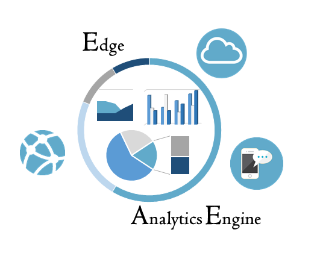

Edge Analytics Engine
==========================

1. [What it does?](#what-it-does?)
2. [Tools for using the Engine](#tools-for-using-the-engine)
3. [For End Users](#for-end-users)
4. [Examples](#examples)
5. [Contributions](#contributions)
6. [License](#license)

What it does?
==========================

The Analytics Engine is a framework designed to support
data analysis of services deployed in a cloud environment.
Telemetry and infrastructure topology are used as enablers of
different (and flexible) analysis tasks, models and knowledge base
construction.

The goal of this projects are:
* Provide a powerful, lightweight tool able to collect infrastructure capabilities
* Simplify the way analytics tasks are performed
* Allow scalable execution of diverse analytics tasks
* Provide flexible mechanisms aiming at embedding models and knowledge base available for
analysis.
* Technology agnostic, by means of aiming at supporting analytics tasks without the tight link
  with the technology used (e.g., OpenStack, Docker, etc.)
* Lightweight and structured in such a way that it can easily run on constrained devices.
* Highly customizable, we give you the core, you turn it into beautiful analytics pipelines.

Tools for using the Engine
==========================

* [Landscaper](https://github.com/IntelLabsEurope/landscaper): The supported tool for topology.
* [SNAP](https://github.com/intelsdi-x/snap): The supported tool for telemetry.

For End Users
==========================
As an end user of the Edge Analytics Engine, you'll be able to perform analytics tasks
from either Command Line or the provided Rest API.

Rest API is documented [here](heuristics/sinks/mf2c/README.md).

Examples
------------------
[Test_client folder](test_client/) provides examples of using The Edge Analytics Engine from Rest API.

Contributions
=================================================
Contributions from the community are highly appreciated. The Analytics engine needs:

* Contributors: We appreciate reviews and support on the core framework
* Integrations: Do you want to test out our core framework and extend it with more models and analytics tasks?
 You are more than welcome!

Just a few small steps separate you from contributing, take a look at our [CONTRIBUTING.md](CONTRIBUTING.md) section.

License
=================================================
The Edge Analytics Engine is an Open Source software released under the [Apache 2.0 License](LICENSE).
