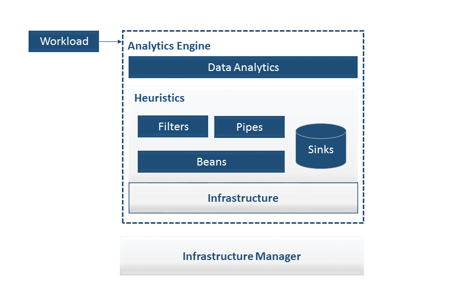
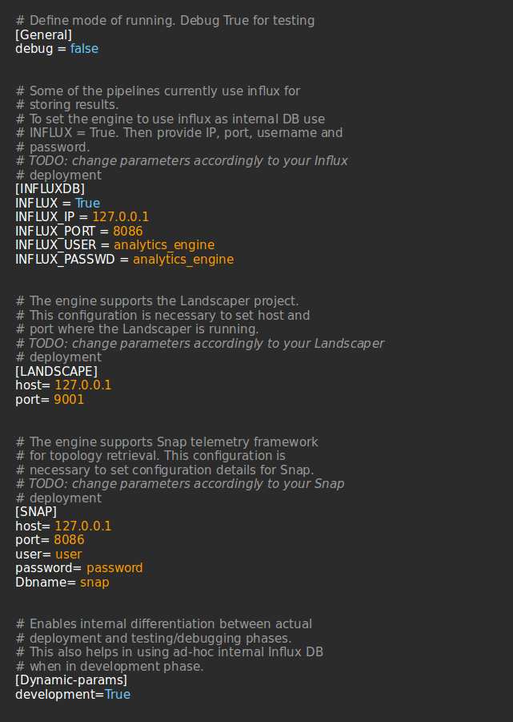

Edge Analytics Engine
==========================

1. [Introduction](#introduction)
2. [Analytics Engine Architecture](#analytics-engine-architecture)
	* [Heuristics](#heuristics)
	* [Pipelines and Filters](#pipelines-and-filters)
	* [Beans](#beans)
	* [Sinks](#sinks)
	* [Data Analytics](#data-analytics)
	* [Infrastructure Manager](#infrastructure-manager)
3. [Analytics Engine Installation](#analytics-engine-installation)
    * [Get it started](#get-it-started)
    * [Installation Requirements](#installation-requirements)
    * [Configure the Engine](#configure-the-engine)
    * [Ready to Go](#ready-to-go)
4. [Dockerized Analytics Engine](#dockerized-analytics-engine)
    * [Requirements](#requirements)
    * [Download the code](#download-the-code)
    * [Compose](#compose)
4. [Analytics Engine Usage](#analytics-engine-usage)
	* [Command Line](#command-line)
	* [Messaging the API](#messaging-the-api)
5. [Deployment Considerations](#deployment-considerations)

Introduction
==========================

The Analytics Engine is a framework designed to support
data analysis of services deployed in a cloud environment.
Telemetry and infrastructure topology are used as enablers of
different (and flexible) analysis tasks, models and knowledge base
construction.

The goal of this projects are:
* Provide a powerful, lightweight tool able to collect infrastructure capabilities
* Simplify the way analytics tasks are performed
* Allow scalable execution of diverse analytics tasks
* Provide flexible mechanisms aiming at embedding models and knowledge base available for
analysis.
* Technology agnostic, by means of aiming at supporting analytics tasks without the tight link
  with the technology used (e.g., OpenStack, Docker, etc.)
* Lightweight and structured in such a way that it can easily run on constrained devices.
* Highly customizable, we give you the core, you turn it into beautiful analytics pipelines.

Future Development
------------------
Even if the engine at this point in time supports Cloud environment, it has been designed to
embrace the scalability, complexity and heterogeneity requirements of Systems of Systems (SoS).

Indeed, it can be deployed as a self-contained monitoring and analytics solution, able to
add autonomous awareness of self behaviour.

It is also flexible enough to be easily extended to support different telemetry tools, technologies
and output communication/storage.

Analytics Engine Architecture
=================================================
The high level architecture of the Analytics Engine is shown in the following.

The Analytics Engine implement a flexible multi-layer architecture.

Thus, it is designed to perform core duties by exposing
the following components:

* Data Analytics - that includes models and higher level analytics tasks.
* Heuristics - that provides the main pieces to gather topology and telemetry in a
meaningful manner to be used for analysis purposes.
* Infrastructure Manager - that deals with the actual retrieval of the underlying
telemetry and infrastructure topology (low level). Currently snap is considered as
telemetry collector, while the Landscaper is supported as regards topology.

Heuristics
----------
This entire component provides some of the core functionalities and mechanisms,
which are in common for all the analysis tasks that can be built on top of it.
It implements a simple, robust, scalable architecture: Pipe-and-Filter.
Filters can be used as a sequence or - when possible - they can working all at
the same time to improve overall performances.

The **Filter** transforms the data received along the pipeline and its output can either
be given as input to the following Filter in the **Pipe** or be the ultimate results,
thus becoming an input for the **Sink** (e.g., a file, a DB, etc.)

Pipelines and Filters
-------------------

Different pipelines (and relative filters) are supported at the moment:
* Telemetry Annotation Pipeline - which provides infrastructure annotated with relative
    telemetry data: it is where all the magic starts to happen!
* Average utilization and saturation - which provides infrastructure usage by means of average utilization
    (compute, disk, network and memory).
* Optimal Pipe - given a recipe, and the current infrastructure status,
    provides an ordered list of hosts optimized by compute resource usage.
* Analyse Pipe - triggers the analysis tasks of a service deployed (in the cloud or into the edge.
* Refine Recipe Pipe - given a previous analysis tasks, refines the latest recipe.

Beans
-------
Reusability is a core objective of the engine. It is thus desirable to use components previously built
in recurring environments (our analysis tasks!).
The Engine encapsulates and model fundamental objects that walk through the entire pipeline with *Beans*.

They come with several features:
* Support for persistence;
* Support for customization;
* Beans' properties can be manipulated by getter and setter methods.

Sinks
-------
We provide different sinks to save to and extract data from:
* [File] - that saves and retrieves data from local file system
* [Rest] - that provides our Rest API
* [Influx] - supported for internal operations

Data Analytics
----------------
This component accommodates all the supporting models and algorithms to be used for analysis.
Currently basic utilization and saturation algorithms are supported.

Infrastructure Manager
-------------------------
Manages the details with infrasturcure and telemetry retrieval.
At the moment we provide support for:
* [Landscaper](https://github.com/IntelLabsEurope/landscaper) for topology.
* [SNAP](https://github.com/intelsdi-x/snap) or [PROMETHEUS](https://prometheus.io) for telemetry.

Analytics Engine Installation
=============================================

Get it started
----------------
First Clone the repository

    mkdir software
    cd software
    git clone analytics_engine

Install Python dependencies:

    apt-get update
    apt-get install -y python-setuptools python-pip python-dev
    pip install virtualenv

Setting up the virtual environment, which requires python 2.7:

    cd ~/
    virtualenv -p /usr/bin/python2.7 analytics_engine
    source ~/analytics_engine/bin/activate

Installation Requirements
------------------------

Install project requirements:

    cd ~/dev/analytics_engine
    pip install -r requirements.txt

Configure the engine
------------------------
You can configure the engine by customizing the *analytics_engine.conf*

The following example shows some of the major setting required:

1. **[General]** - specify if you are running the engine in debugging mode;
2. **[INFLUXDB]** - the engine supports InfluxDB for internal processing;
                customize this section to configure your Influx Deployment.
                Set INFLUX = False, if you do not want to store internal data.
                Please note that some of the currently supported pipelines need
                an internal Influx to work.
3. **[LANDSCAPE]** - the analytics engine avails of the Landscaper project to gather
                 topology. Use this section to configure where there Landscaper is
                 running.
4. **[SNAP]** - the engine currently supports Snap telemetry. Use this section to configure
            where Snap is collecting data and relative access data.
6. **[PROMETHEUS]** - The engine also supports Prometheus telemetry. Set the host and port of prometheus data source 
7. **[Dynamic-params]** - set development accordingly to your deployment type.
8. **[CIMI]** - The engine supports CIMI service catalog. Set the url of the CIMI REST API

Ready to Go
------------------------

Install the Analytics Engine:

    python setup.py install

Dockerized Analytics Engine
=============================================

Requirements
----------------
Ensure that docker and docker-compose are properly installed and running before
attempting to dockerize the Engine.

Download the code
----------------
First Clone the repository

    mkdir software
    cd software
    git clone analytics_engine

Compose
----------------
In order to start the engine in a docker container simply run:

    docker-compose up

To check that everything went smoothly run:

    docker-compose ps

Analytics Engine Usage
================================
The Analytics engine provides a single entry point whilst supporting two main usage modes:
* Command line
* Rest API

Command Line
----------
The commands supported from the engine via command line - at the moment supports - are the following command:

    $ analytics_engine --run 'analysis task' --workload_name 'workload_name' --ts_from 'start' --ts_to 'end'

    where:
        - --run: specifies to run the wanted analytic task
        - --workload_name: specifies the name of the workload to enquiry to provide analytics on top
        - --ts_from: specifies the start time of the workload placement/execution
        - --ts_to: specifies the end time of the workload (if any)

At the moment the engine supports **annotated graph retrieval** and **average analysis**
performed on *utilization* and *saturation* values.

Messaging the API
------------------
Everything starts with a simple:

    $ analytics_engine --run 'rest'

This command will power up a Flask server. Current functionalities available through Rest API are:
* Require a host list ordered such that it optimized CPU usage.
* Trigger analysis on a deployed workload.
* Ask for a refined recipe based on previous analysis.

Examples of API usage are provided in the [example folder](../examples/) &  [test_client folder](../test_client/).

Deployment Considerations
=============================================
Before choosing how to actually deploy the Edge Analytics Engine, there are some considerations to take into account.
Since the engine aims at being as generic as possible, it supports (as shown before)
different deployments,usages and interaction types:

* command line, centralized infrastructure analysis.
* rest API, centralized infrastructure analysis
* command line, agent-like
* rest API, agent-like
* rest API, dockerized application

For entire infrastructure monitoring and analytics, we suggest to opt for the centralized analysis.
In this case, indeed, the engine support all the required functionalities to extrapolate infrastructure
data and do reasoning upon it. Don't forget that you can speed up your work by performing parallel analysis!
The engine knows how long it might take for a fairly complex analysis tasks to perform. Splitting computation
on separated filters - when possible - and running them in parallel is doable, yet encouraged!

In case of distributed-edge contexts the agent-like deployment might suite your needs better.

If you want to boost portability - opt for dockerized deployment.

Future development will address other requirements for larger deployments.